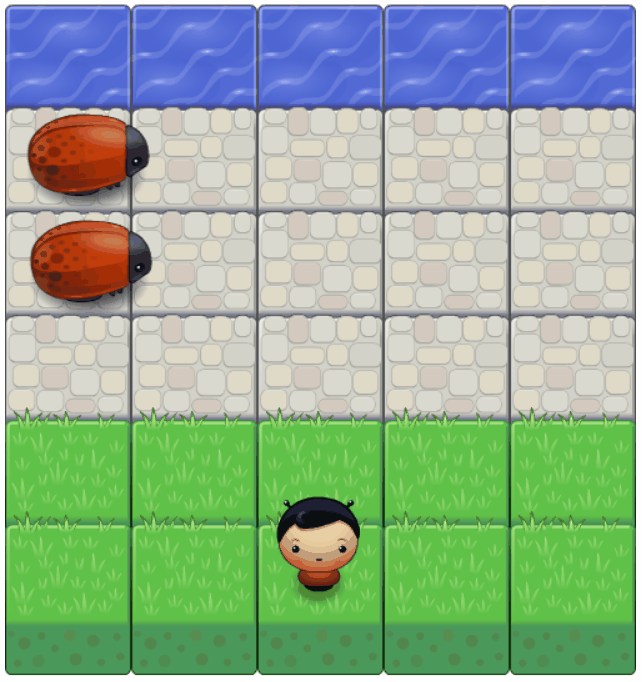
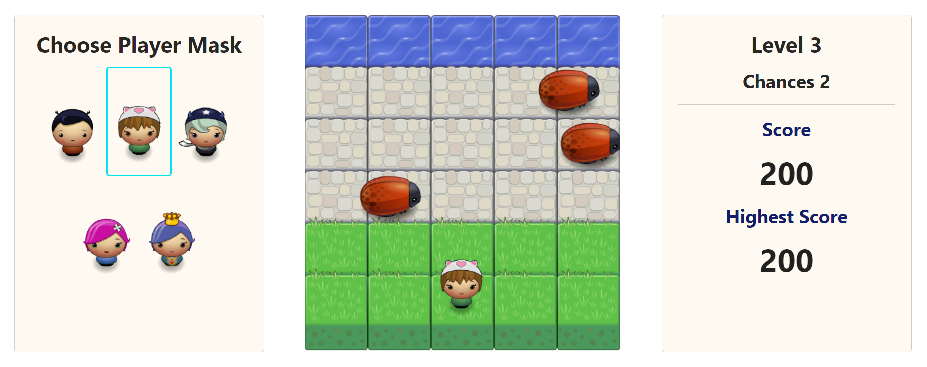

#  Arcade Game

## How the Game Works ?

In this game you have a Player and Enemies (bugs).

```
The goal of the player is to reach the water, without colliding into any one of the enemies.
```


- The player can move left, right, up and down
- The enemies move at varying speeds at different game levels on the paved block portion of the game board
- Once a the player collides with an enemy, the player loose a chance (only 3 chances available) and once the player looses all chances the game is over and game is reset
- Once the player reaches the water (i.e., the top of the game board), the player reaches next level (till 5 levels) after completing all levels game is won

## Additional Features

- [x] Player selection: Select the image for the player character before starting the game.
- [x] Score: Player can check score and highest score.
- [x] Chances: Player having 3 chances to won the game otherwise game is over.
- [x] Levels: Game having 5 levels during which speed of enemy increases to make game hard for player.



## Let's Play

In order to play the game properly, consider the following steps:

- Clone or download this repository
- Open the index.html file in any modern browser, click inside the game area, and enjoy playing the game.