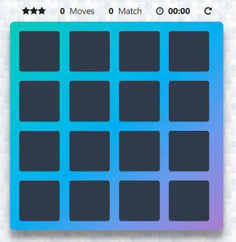

#  Matching Game

Build a complete browser-based card matching game (also known as Concentration).
The game randomly shuffles the cards. A user wins once all cards have successfully been matched.

## How the Game Works ?

The game board consists of sixteen **cards** arranged in a grid. The deck is made up of **eight** different pairs of cards, each with different symbols on one side. The cards are arranged randomly on the grid with the symbol face down.

```
The gameplay rules are very simple: flip over two hidden cards at a time to locate the ones that match!
```

> On each turn:

- The player flips one card over to reveal its underlying symbol.
- The player then turns over a seconad card, trying to find the corresponding card with the same symbol.
- If the cards match, both cards stay flipped over.
- If the cards do not match, both cards are flipped face down.

```
The game ends once all cards have been correctly matched.
```
## Features

> Dashboard

| Items | Description |
| ----- | ----------- |
| Star Rating | Rate the player's performance |
| Moves Count | Current number of moves a user has made |
| Match Count | Current number of matches a user has made |
| Time Watch | Time lapsed after user has started game |
| Reset Game | Reset the game and dashboard stats |

> Modal

| Modal | Description |
| ----- | ----------- |
| Form Modal | Capturing player name and start game |
| Congrats Modal | Congratulate the player and update stats |
| Game Info Modal | Describe about game |
| Key Info Modal | Describe key control usage |


## Stand Out Features

- [x] CSS animations when cards are clicked, unsuccessfully matched, and successfully matched
- [x] Leaderboard implementation to store player records and display 5 top scores  using local storage
- [x] Code optimizations and user experience of the game (keyboard shortcuts for gameplay)


## Screenshots

### Start Game - _Game starts with all cards face down_

### Complete Game - _Game ends with all cards correctly matched_

### Correct Guess - _If the cards match, both cards show success stay flipped over_

### Incorrect Guess - _If the cards do not match, both cards show warning and flipped back_


___